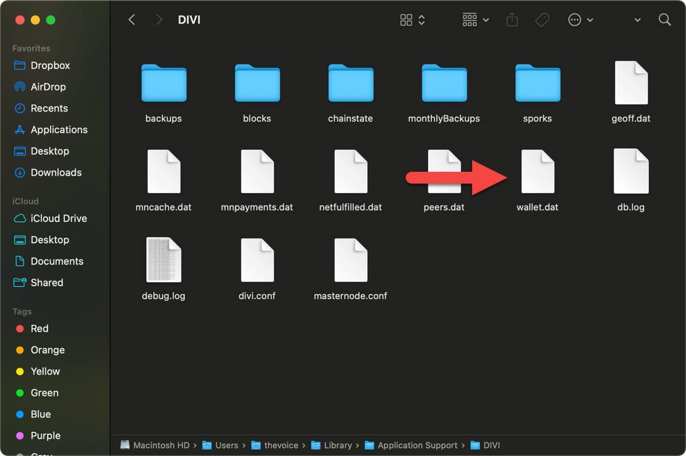

# **DO NOT EVER SAVE YOUR SEED WORDS (seed phrases, recovery phrases) IN A TEXT DOCUMENT - EVER!**

## Mac Recovery of Divi Wallet in Divi Desktop Application

---

**Make sure the Divi Desktop Application is closed before starting.**

**Note: Don't forget to set a password for Divi Desktop after you have migrated into Divi Desktop.**

Hi everyone! In today’s tutorial, I’ll walk you through the process of recovering your Divi Wallet using the Divi Desktop Application on macOS. We’ll go step-by-step through the recovery process using your mnemonic (seed phrase) and the terminal.

Let’s get started!

---

### Syntax for Recovery:
```
./divid -mnemonic="word1 word2 word3 word4 word5 word6 word7 word8 word9 word10 word11 word12" -force_rescan=1 &
```
**Note:** If you encounter the error:  
*Error: There is no RPC client functionality in divid anymore. Use the divi-cli utility instead.*,  
this usually indicates a syntax error. Review your command for missing or incorrect quotes (`"`), hyphens (`-`), or spelling mistakes.


### Path in Terminal:
```
cd ~/Library/Application\ Support/Divi\ Desktop/divid/unpacked/divi_osx
```

### Prep Work:
1. Divi Desktop should be installed, fully synced and shutdown.

---

## Step A: Prepare for Wallet Recovery

1. Open Finder and press `Command + Shift + G` to open the "Go to Folder" dialog.
2. Type or **copy and paste** the following command into the dialog, then press **Enter**:
     ```
     ~/Library/Application Support/
     ```
     - Click the copy icon to the right or highlight the command above and press Command + C. To paste, press Command + V in the dialong box.
     
     Example:
     Open AppData / Roaming in Finder Search as shown below:

     
3. Navigate to the **DIVI** folder (not Divi Desktop).
   - Locate wallet.dat

     Example:
     Open DIVI foloder and locate wallet.dat:

     
     
5. Rename `wallet.dat` to `wallet_backup.dat`.
   *Note: macOS may ask for permission.* If you make a mistake with the name or extension, simply start over, then proceed to step 5.
   Example:
   Rename wallet.dat by using CRTL + Click the file or with wallet.data highlighted chose file > rename in Finder:

     

6. Now, move back up one level in finder and enter into the **Divi Desktop** folder.
   - Navigate to the `Divi Desktop` directory inside `Application Support`.
   - Open the **Divi Desktop** folder (not `DIVI`).

7. Delete the `divitxs.db` file:
   - Inside the **Divi Desktop** folder, find and delete the `divitxs.db` file.  
   - If the file extension isn't visible, it may appear as `divitxs`.

     Example:
     Delete the divitxs.db file:

     

8. Close the Finder window.

---

## Step B: Recover Your Divi Wallet

1. Open the **Terminal** application (you can find it in Applications > Utilities or search using Spotlight).
2. Navigate to the Divi daemon directory:
   - **Copy and paste** the following command into the Terminal, then press **Enter**:
     ```bash
     cd ~/Library/Application\ Support/Divi\ Desktop/divid/unpacked
     ```
     - To copy, click the copy icon to the right or highlight the command above and press Command + C. To paste, press Command + V in the Terminal.
     
     Example:
     Path Example:

     

3. Before running the daemon, make it executable:
   - **Copy and paste** the following command into the Terminal and press **Enter**:
     ```bash
     chmod +x *
     ```
     - To copy, click the copy icon to the right or highlight the command above and press Command + C. To paste, press Command + V in the Terminal.

     Example:
     Permissions Example:
     

4. Now, run the following recovery command, replacing `word1` through `word12` with your actual seed words and hit ENTER!
    ```
    ./divid -mnemonic="word1 word2 word3 word4 word5 word6 word7 word8 word9 word10 word11 word12" -force_rescan=1 &
    ```
    Make sure your seed words are all lowercase, with a single space between each word.
   Example:
   Either copy to a note you dont save or paste on command lined and edit using right and left arrow keys.

     
   

**Note:** If you encounter the error:  
*Error: There is no RPC client functionality in divid anymore. Use the divi-cli utility instead.*,  
this usually indicates a syntax error. Review your command for missing or incorrect quotes (`"`), hyphens (`-`), or spelling mistakes.


5. Wait a few moments, then open the Divi Desktop Application.
   - Proceed to Final Steps
---

## 🎯 Final Steps

1. Let the Divi Desktop Application sync completely and wait for your coins to appear in the **Total Balance** (top left).
2. After Fully Synced, Fully Confirmed Balance
   A. Close Divi Desktop
   B. Close Terminal
3. Wait 30 Seconds
4. Restart Divi Desktop
5. Allow to sync fully (balance showing, fully synced in bottom left corner)
**DON'T FORGET TO SET A PASSWORD**
6. Set a password

> **Note:** For the Final Steps, Step 2 is process order, dont change or mix.

You're all set at recovering your Divi wallet in the Divi Desktop Application on macOS.
